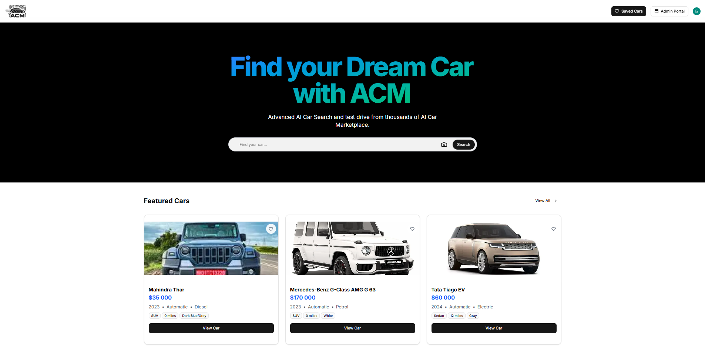
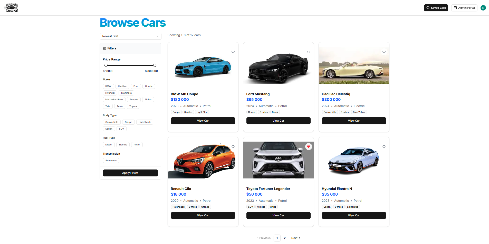
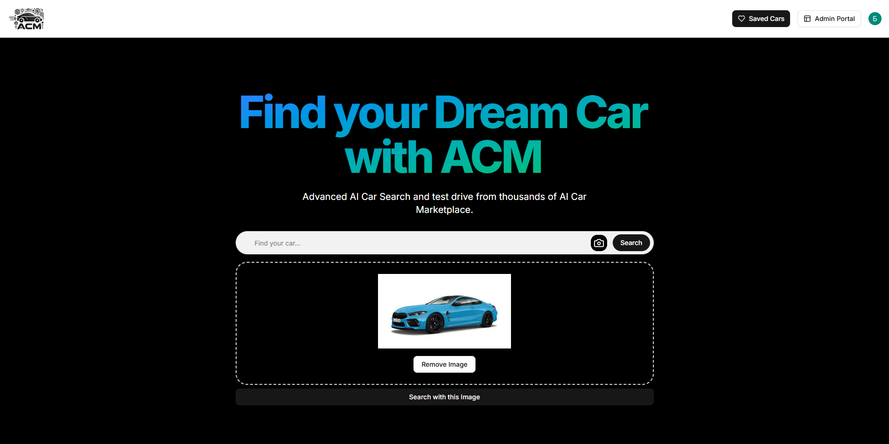
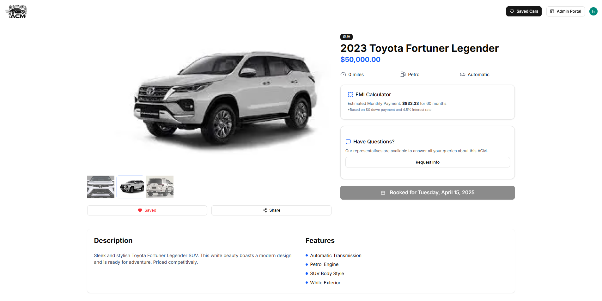
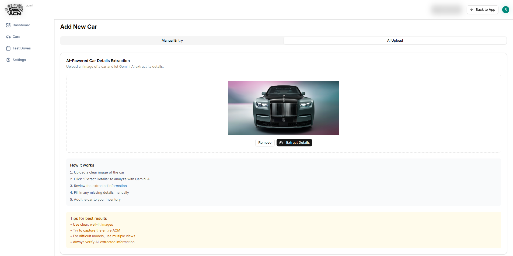
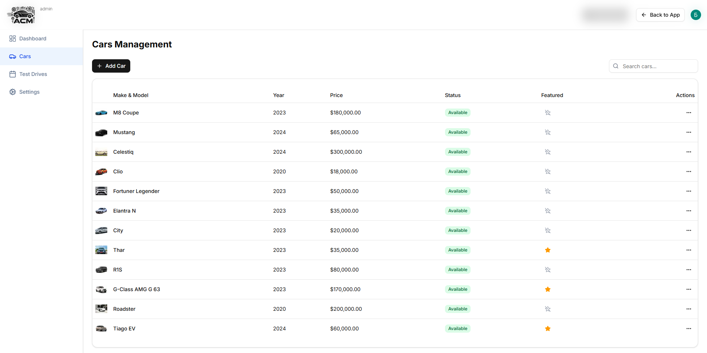
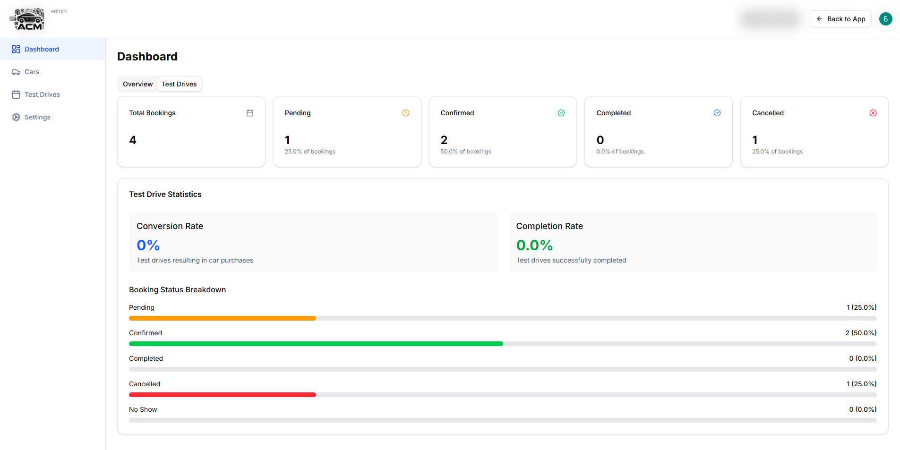
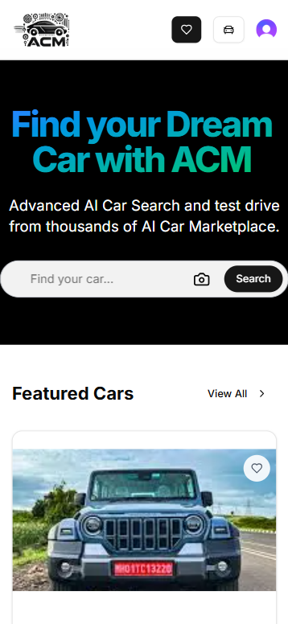
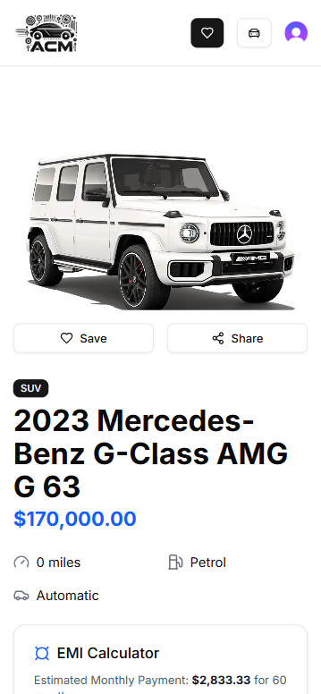
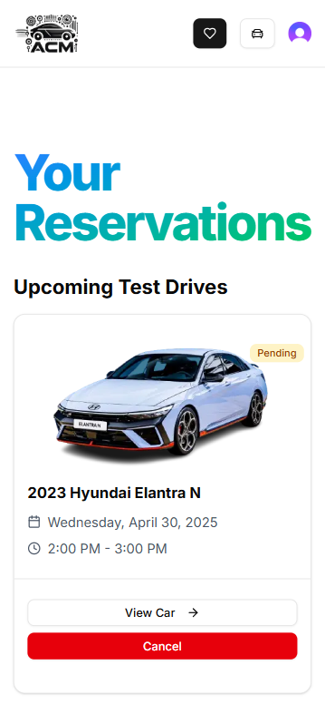

# AI Car Marketplace

---

## Описание

**AI Car Marketplace** — это полнофункциональное маркетплейс-приложение для покупки, продажи и управления автомобилями.

---

## 🚀 Live Demo

<p align="center">
  <a href="https://ai-car-marketplace-rouge.vercel.app">
    
  </a>
  <br />
  <a href="https://github.com/Bogdan-Afanasev/ai-car-marketplace">
    
  </a>
</p>

---

## 🎞️ Demo (GIF)

### Admin Flow


### User Flow


### AI Photo Search


### Mobile View (Responsive)


---

## 📸 Screenshots (Desktop)

### Главная страница



### Все автомобили + фильтрация



### Поиск по фото



### Просмотр автомобиля



### Добавление машины



### Панель администратора



### Dashboard



---

## 📸 Screenshots (Mobile)

### Главная страница (адаптив)



### Просмотр авто



### Профиль пользователя



---

## 🧪 Функциональность

- [x] Адаптивный UI
- [x] Авторизация и роли
- [x] Поиск автомобилей вручную и по фото (AI)
- [x] Заказ тест-драйвов и управление ими
- [x] Личный кабинет пользователя
- [x] Панель администратора (добавление, удаление машин, управление админами, рабочими часами)
- [x] Дашборд статистики
- [x] Умный подбор характеристик по изображению (для админов)

---

## ⚙️ Технологии

### Frontend

- React 19
- Next.js 14 / App Router
- Tailwind CSS + shadcn/ui
- TypeScript
- Zustand
- React Hook Form
- Clerk Auth
- UploadThing
- Framer Motion

### Backend & DB

- Supabase (PostgreSQL + Storage)
- Prisma ORM
- Convex Functions
- Gemini API (AI)
- Rate Limiting / Arcjet

### Tools

- Git / GitHub
- ESLint / Prettier
- Vercel (хостинг)
- Docker (dev)

---

## 🛠️ Установка и запуск

```bash
git clone https://github.com/Bogdan-Afanasev/ai-car-marketplace.git
cd ai-car-marketplace
npm install
npm run dev
```

## 🔐 .env переменные

Создайте `.env.local` файл и добавьте:

```env
NEXT_PUBLIC_CLERK_PUBLISHABLE_KEY=your_key
CLERK_SECRET_KEY=your_key

NEXT_PUBLIC_CLERK_SIGN_IN_URL=/sign-in
NEXT_PUBLIC_CLERK_SIGN_UP_URL=/sign-up

DATABASE_URL=your_key
DIRECT_URL=your_key

ARCJET_KEY=your_key
ARCJET_ENV=your_key

GEMINI_API_KEY=your_key

NEXT_PUBLIC_SUPABASE_URL=your_key
NEXT_PUBLIC_SUPABASE_ANON_KEY=your_key
```

---

## 🤝 Автор

[](https://github.com/Bogdan-Afanasev)  
**Богдан Афанасьев** — Frontend Developer / Fullstack Enthusiast / Philosopher-in-Progress  
[GitHub](https://github.com/Bogdan-Afanasev) | [Telegram](https://t.me/bogdan_afanasev_dev) | [Email](mailto:bogdan.way.00@gmail.com)

---

## ⚖️ Лицензия

Этот проект создан исключительно в учебных целях. Все использованные API, стили и технологии принадлежат их соответствующим владельцам. Проект не предназначен для коммерческого использования.

---

Наслаждайтесь — и не забудьте ⭐ звезду, если вам понравилось!
